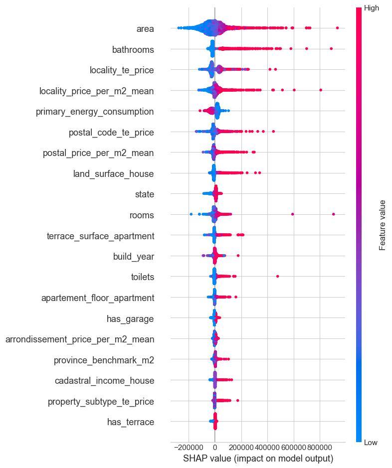

# Immo-Eliza — Real-Estate Price Predictor (Belgium)

## 1. Project Overview

This project implements a **robust, leakage-safe, end-to-end data pipeline** for predicting real-estate prices in Belgium.  
The dataset is enriched with:

- Geographic hierarchy (municipality, arrondissement, province, region)  
- Socio-economics (median municipal income)  
- Address-level fields  
- National, regional, and provincial benchmark prices per m²  
- Local price aggregates (postal, locality)  
- Advanced engineered ML features (missingness flags, log transforms, smoothed target encoding)

The pipeline is designed to be **modular, reproducible**, allowing training of models such as Linear Regression, Random Forest, and XGBoost.

---

## 2. Repository Structure

```
immo-eliza-Amine/
│
├── config/
│   ├── paths.py
│   └── settings.py
│
├── data/
│   ├── raw/
│   ├── stage1/
│   ├── stage2/
│   ├── stage3/
│   └── clean/
│
├── notebooks/
│   └── analysis.ipynb
│
├── pipelines/
│   ├── stage0_load_raw.py
│   ├── stage1_basic_cleaning.py
│   ├── stage2_plausibility_outliers_missing.py
│   ├── stage2_5_geo_enrichment.py
│   ├── stage3_feature_engineering.py
│   ├── stage3_fitted.py
│   └── pipeline_runner.py
│
└── utils/
    └── ml_utils.py
```

---

## 3. End-to-End Pipeline Architecture

The processing workflow is structured into **strict leakage-safe stages**:

```
Stage 0 → Stage 1 → Stage 2 → Stage 2.5 → Stratified Split → Stage 3 (Fit/Transform)
```

---

## 4. Stage-by-Stage Documentation

### 4.1 Stage 0 — Load Raw Dataset

- Load CSV  
- Remove duplicates  
- Validate schema  
- Enforce core dtypes  
- Drop invalid rows  

### 4.2 Stage 1 — URL-Based Extraction & Basic Cleaning

- Extract postal code, locality, subtype  
- Clean numeric/Yes–No fields  
- Normalize property subtype  
- Map to Apartment / House / Other  

### 4.3 Stage 2 — Plausibility Checks, Encoding, Outlier Removal

Stage 2 applies domain-driven cleaning rules to guarantee data consistency without introducing leakage.

All plausibility thresholds (price, area, rooms, EPC, surfaces, floors, CO₂, cadastral income, etc.) were defined exclusively using domain expertise and real-estate knowledge, not statistical summaries computed from the dataset.
This ensures the entire process remains leakage-free, since no information from validation or test distributions is used during cleaning.
- Drop sparse/noisy columns  
- Encode categorical & binary fields  
- Replace missing numeric with -1  
- Apply plausibility rules  
- Split out outliers  

### 4.4 Stage 2.5 — Geographic & Socio-Economic Enrichment

Adds:

- Municipality, arrondissement, province, region  
- Median municipal income from external datasets
- Address table  
- Provincial, regional, national benchmark prices  
- Engineered benchmark features  

### 4.5 Stratified Split (70/15/15)

- Stratify on price quantile bins  
- Prevent distribution shift  
- Ensures all price ranges represented  

### 4.6 Stage 3 — Final Feature Engineering (Fit/Transform)

- Missingness flags  
- Convert -1 → NaN  
- Final imputation (train-fitted)  
- price_per_m2, log(area)  
- Geo aggregates  
- Target encoding (train-only)  

---

## 5. Machine Learning Workflow

### Model Modes

**Linear Regression**  
- Numeric only  
- No TE  
- No derived leakage features  

**Random Forest / XGBoost**  
- Numeric + TE  
- All engineered features  
- Drop leak-prone features  

---

## 6. Model Performance Summary

**Linear Regression**  
- R²: 0.58–0.60 
- MAE: 86k-90k 
- Underfits slightly  

**Random Forest**  
- R²: 0.75–0.78  
- MAE ~51k–53k  

**XGBoost (Best), light tuning and 5-cross validation**  
- R²: 0.8474 ± 0.0230 
- MAE: 45.2k ± 1405

---

## 7. Running the Pipeline

```bash
python -m venv .venv
source .venv/bin/activate
pip install -r requirements.txt
```

```python
from pipelines.pipeline_runner import run_full_pipeline_with_split
run_full_pipeline_with_split()
```

```python
jupyter notebook notebooks/analysis.ipynb
```

---

## 8. XGBoost Tuning & Cross-Validation

XGBoost was tuned using a focused grid search with **3-fold cross-validation** to balance training time and generalization.  
Only the most impactful hyperparameters were explored (e.g., `learning_rate`, `max_depth`, `n_estimators`, `subsample`, `colsample_bytree`).

This approach allowed the model to:
- Reduce overfitting  
- Stabilize performance across splits  
- Improve MAE and R² compared to untuned XGBoost  

The tuning was fully **leakage-safe**, applied only on the training split after Stage 3 feature engineering.

Best Hyperparameters:

- model__colsample_bytree: 0.8
- model__learning_rate: 0.05
- model__max_depth: 10
- model__n_estimators: 500
- model__subsample: 0.8


## 9. SHAP Feature Interpretation

SHAP (Shapley Values) was used to interpret model predictions and understand which engineered features contributed most to price estimation.

Key insights:
- Area, bathrooms, geo-aggregates, and benchmark ratios were strong positive contributors.
- Missingness flags, poor property state, and low regional ratios often pushed predictions down.
- Geo-features from Stage 2.5 were highly influential, confirming the strength of the enrichment step.

SHAP summary and bar plots provided a clear global view of feature importance without introducing any leakage.



## 10. Future Improvements

- OSM distance-based features (distance to nearest facility)  
- Nearest-neighbor comparable prices  
- Micro-market clustering  
- CatBoost / LightGBM  
- Optuna tuning 
- Specialized models for luxuary vs luxuary
- Specialized models for apartment vs house
- Robust tuning of the ensemble models
---

### 9. Contributors
- [Amine Samoudi](https://github.com/AmineSam)